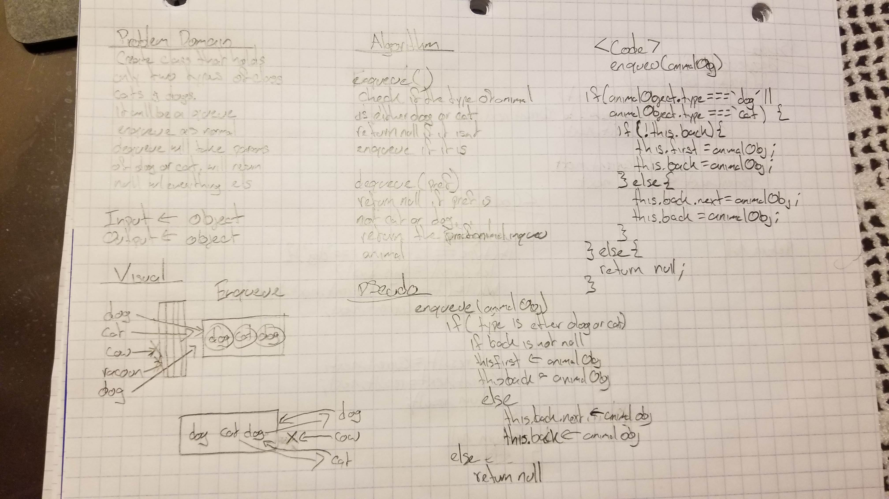
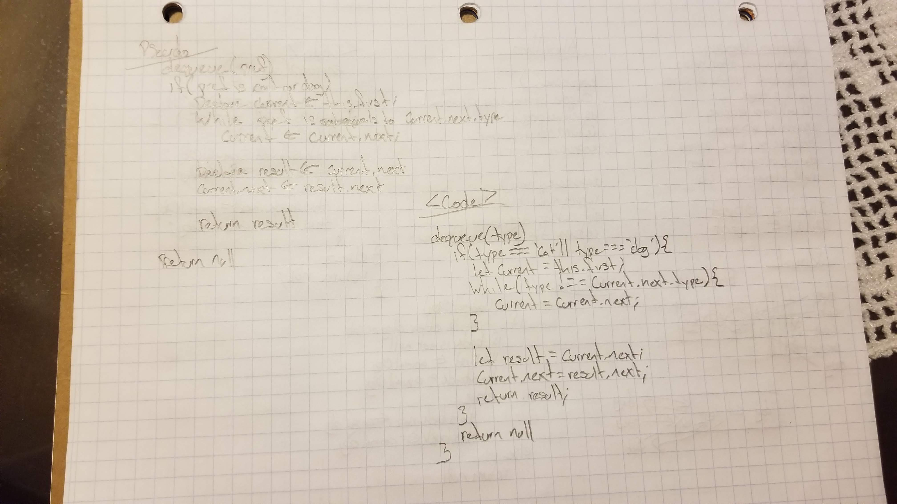

# FIFO AnimalShelter

Create a class called AnimalShelter which holds only dogs and cats. The shelter operates using a first-in, first-out approach.
Implement the following methods:
enqueue(animal): adds animal to the shelter. animal can be either a dog or a cat object.
dequeue(pref): returns either a dog or a cat. If pref is not "dog" or "cat" then return null.

## Challenge
```Javascript
enqueue(animalObject){
    if(animalObject.type === 'dog' || animalObject.type === 'cat'){
      if(!this.back){
        this.first = animalObject;
        this.back = animalObject;
      } else{
        this.back.next = animalObject;
        this.back = animalObject;
      }
    } else{
      return null;
    }
  }
```

```Javascript
  dequeue(type){
    if(type === 'cat' || type === 'dog'){
      let current = this.first;
      while(type !== current.next.type){
        current = current.next;
      }

      let result = current.next;
      current.next = result.next;

      return result;
    }
    return null;
  }
}
```

## Solution


