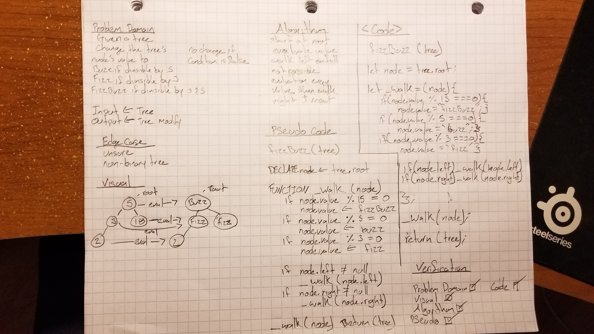

# FizzBuzz Tree
* Write a function called FizzBuzzTree which takes a tree as an argument.

## Challenge
* Without utilizing any of the built-in methods available to your language, determine weather or not the value of each node is divisible by 3, 5 or both, and change the value of each of the nodes:
  *  If the value is divisible by 3, replace the value with “Fizz”
  *  If the value is divisible by 5, replace the value with “Buzz”
  *  If the value is divisible by 3 and 5, replace the value with “FizzBuzz”
  * Return the tree with its new values.

## Approach & Efficiency
O(n) This will take as long as there are nodes in the tree as the code needs to visit them all.

## Solution


## Function
```Javascript
fizzBuzz = (treeObj) =>{

  let node = treeObj.root;

  let _walk = node => {

    if(node.value % 15 === 0){
      node.value = 'FizzBuzz';
    } else if(node.value % 5 === 0){
      node.value = 'Buzz';
    } else if(node.value % 3 === 0){
      node.value = 'Fizz';
    }

    if (node.left) _walk(node.left);

    if (node.right) _walk(node.right);
  };

  _walk(node);

  return treeObj;
};
```