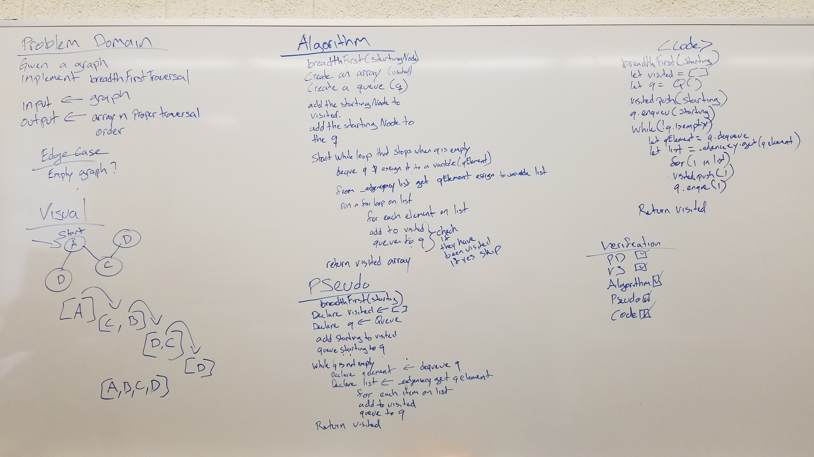

# Summary and name of challenge
A Graph is a non-linear data structure consisting of nodes and edges. The nodes are sometimes also referred to as vertices and the edges are lines or arcs that connect any two nodes in the graph. More formally a Graph can be defined as, "A Graph consists of a finite set of vertices(or nodes) and set of Edges which connect a pair of nodes."

## Challenge
Implement your own Graph. The graph should be represented as an adjacency list, and should include the following methods:

* addNode()
  * Adds a new node to the graph
  * Takes in the value of that node
  * Returns the added node
* addEdge()
  * Adds a new edge between two nodes in the graph
  * Include the ability to have a “weight”
  * Takes in the two nodes to be connected by the edge
  * Both nodes should already be in the Graph
* getNodes()
  * Returns all of the nodes in the graph as a collection (set, list, or similar)
* getNeighbors()
  * Returns a collection of nodes connected to the given node
  * Takes in a given node
  * Include the weight of the connection in the returned collection
* size()
  * Returns the total number of nodes in the graph

## Approach & Efficiency
* addNode() -> O(1)
* addEdge() -> O(1)
* getNodes() -> O(n)
* getNeighbors() -> O(1)
* size() -> O(1)

## API
* addNode() -> O(1) Adds a vertex to the graph
* addEdge() -> O(1) Adds an edge to a vertex
* getNodes() -> Retruns a list of all vertexes
* getNeighbors(vertex) -> Returns all adjecent vertexes
* size() -> Gets the numbers of vertexes in the graph


# BreadthFirst Challenge Summary
Extend your graph object with a breadth-first traversal method that accepts a starting node. 

## Challenge Description
Without utilizing any of the built-in methods available to your language, return a collection of nodes in the order they were visited. Display the collection.

## Approach & Efficiency
O(n) to traverse. Depends on the number of vertices and edges

## BreadthFirst Solution


```Js
  breadthFirst(startingNode){
    if(!startingNode){
      return 'Missing starting node';
    }
    let visited = [];
    let q = new Queue();

    visited.push(startingNode);
    q.enqueue(startingNode);

    while (q.peek()) {
      let getQueueElement = q.dequeue();

      let list = this._adjacencyList.get(getQueueElement);
      for (let i in list) {
        let neigh = list[i];
        if (!visited.includes(neigh)) {
          visited.push(neigh.vertex);
          q.enqueue(neigh);
        }
      }
    }
    let keys = visited.map(key => key.value);
    return keys;
  }
```