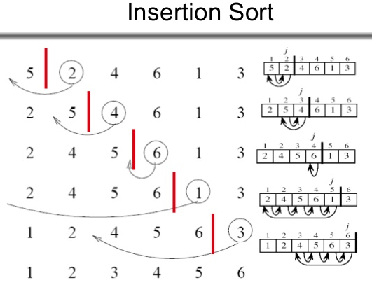

# Insertion Sort
## Learning Objectives
Insertion sort is a simple sorting algorithm that works the way we sort playing cards in our hands<sup>1</sup>. Insertion sort is a simple sorting algorithm that builds the final sorted array (or list) one item at a time. It is much less efficient on large lists than more advanced algorithms such as quicksort, heapsort, or merge sort<sup>2</sup>.

## Lecture Flow
* Diagram
* Algorithm
* Pseudocode
* JS code
* Reading and References

## Diagram


## Algorithm
It iterates the input elements by growing the sorted array at each iteration. It compares the current element with the largest value in the sorted array. If the current element is greater, then it leaves the element in its place and moves on to the next element else it finds its correct position in the sorted array and moves it to that position. This is done by shifting all the elements, which are larger than the current element, in the sorted array to one position ahead

## Efficiency

|Class	|Sorting algorithm |
|---|---|
Data structure	| Array
Worst-case performance|	О(n2) comparisons and swaps
Best-case performance	|O(n) comparisons, O(1) swaps
Average performance	|О(n2) comparisons and swaps
Worst-case space complexity	|О(n) total, O(1) auxiliary

* Efficient for (quite) small data sets, much like other quadratic sorting algorithms
* More efficient in practice than most other simple quadratic (i.e., O(n2)) algorithms such as selection sort or bubble sort

## Pseudocode
```
InsertionSort(int[] arr)

  FOR i = 1 to arr.length
  
    int j <-- i - 1
    int temp <-- arr[i]
    
    WHILE j >= 0 AND temp < arr[j]
      arr[j + 1] <-- arr[j]
      j <-- j - 1
      
    arr[j + 1] <-- temp
```

### Code
```Javascript
module.exports = exports = (arr) => {

  // https://stackoverflow.com/questions/32817027/check-if-an-array-contains-only-numeric-values
  if(arr.some(isNaN)){
    throw new Error('Not all elements are numbers');
  }

  for(let i = 0; i < arr.length; i++){
    let j = i - 1;
    let temp =  arr[i];
    while(j >= 0 && temp < arr[j]){
      arr[j + 1] = arr [j];
      j = j - 1;
    }
    arr[ j+ 1] = temp;
  }
};
```

## Readings and References

### Watch
* [Geeks for Geeks - Insertion Sort](https://www.youtube.com/watch?v=OGzPmgsI-pQ)

### Read
  * <sup>1</sup> [Geeks for Geeks - Insertion Sort](https://www.geeksforgeeks.org/insertion-sort/)
  * <sup>2</sup>[Wikipedia - Insertion Sort](https://en.wikipedia.org/wiki/Insertion_sort) 

### Bookmark
* [Data Structure and Algorithms Insertion Sort](https://www.tutorialspoint.com/data_structures_algorithms/insertion_sort_algorithm.htm)

