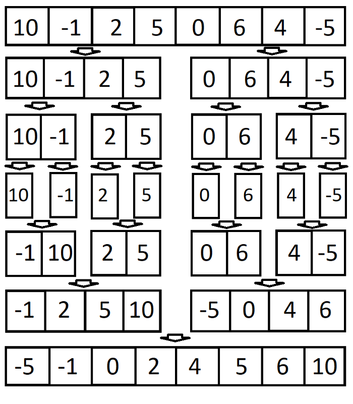

# Merge Sort
## Learning Objectives
Merge sort is one of the most popular sorting algorithms today and it uses the concept of divide and conquer to sort a list of elements. Meaning, it will divide the bigger problem into smaller problems and then solve each of the small problems in order to solve the bigger problem that we started out with. <sup>1<sup>

## Lecture Flow
* Diagram
* Algorithm
* Pseudocode
* JS code
* Reading and References

## Diagram


## Algorithm
* Split array in half
* Keep spliting until the array contains one element
* Order the remaining elements by value
* Repeat until they are in order

## Efficiency
|Class	| Sorting algorithm|
|---|---|
Data structure|	Array
Worst-case performance|	O(n log n)
Best-case performance	|O(n log n) typical, O(n) natural variant
Average performance	|O(n log n)
Worst-case space complexity|	О(n) total with O(n) auxiliary, O(1) auxiliary with linked lists[1]

## Pseudocode
```
ALGORITHM Mergesort(arr)
    DECLARE n <-- arr.length
           
    if n > 1
      DECLARE mid <-- n/2
      DECLARE left <-- arr[0...mid]
      DECLARE right <-- arr[mid...n]
      // sort the left side
      Mergesort(left)
      // sort the right side
      Mergesort(right)
      // merge the sorted left and right sides together
      Merge(left, right, arr)

ALGORITHM Merge(left, right, arr)
    DECLARE i <-- 0
    DECLARE j <-- 0
    DECLARE k <-- 0

    while i < left.length && j < right.length
        if left[i] <= right[j]
            arr[k] <-- left[i]
            i <-- i + 1
        else
            arr[k] <-- right[j]
            j <-- j + 1
            
        k <-- k + 1

    if i = left.length
       set remaining entries in arr to remaining values in right
    else
       set remaining entries in arr to remaining values in left
```

### Code
```Javascript
exports.mergeSort = (unsortedArray) => {

  if(unsortedArray.some(isNaN)){
    throw new Error('Not all elements are numbers');
  }

  if (unsortedArray.length <= 1) {
    return unsortedArray;
  }
  const middle = Math.floor(unsortedArray.length / 2);

  const left = unsortedArray.slice(0, middle);
  const right = unsortedArray.slice(middle);

  return _merge(
    exports.mergeSort(left), exports.mergeSort(right)
  );
};

function _merge (left, right) {
  let resultArray = [], leftIndex = 0, rightIndex = 0;

  while (leftIndex < left.length && rightIndex < right.length) {
    if (left[leftIndex] < right[rightIndex]) {
      resultArray.push(left[leftIndex]);
      leftIndex++;
    } else {
      resultArray.push(right[rightIndex]);
      rightIndex++;
    }
  }

  return resultArray
    .concat(left.slice(leftIndex))
    .concat(right.slice(rightIndex));
}
```

## Readings and References

### Watch
* [Geeks for Geeks - Merge Sort](https://www.youtube.com/watch?v=JSceec-wEyw)

### Read
  * <sup>1</sup> [Medium - Merge Sort Algorithm in JavaScript](https://medium.com/javascript-in-plain-english/javascript-merge-sort-3205891ac060)
  * [Geeks for Geeks - Merge Sort](https://www.geeksforgeeks.org/merge-sort/) 

### Bookmark
* [Merge sort](https://en.wikipedia.org/wiki/Merge_sort)

