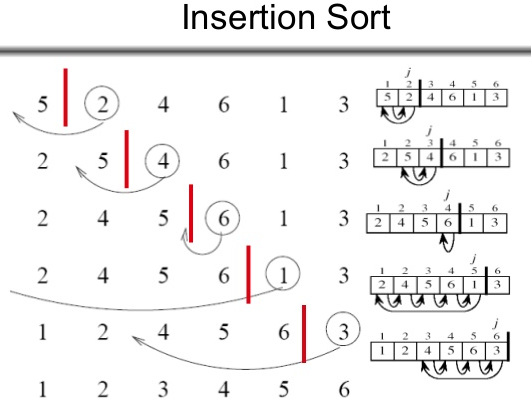

# Insertion Sort
## Learning Objectives
Insertion sort is a simple sorting algorithm that works the way we sort playing cards in our hands. <sup>1</sup>

## Lecture Flow
* Diagram
* Algorithm
* Pseudocode
* JS code
* Reading and References

## Diagram


## Algorithm
Describe in detail how the algorithm works. Include small code snippets to possibly support the points

## Pseudocode
```
InsertionSort(int[] arr)

  FOR i = 1 to arr.length
  
    int j <-- i - 1
    int temp <-- arr[i]
    
    WHILE j >= 0 AND temp < arr[j]
      arr[j + 1] <-- arr[j]
      j <-- j - 1
      
    arr[j + 1] <-- temp
```

### Code
```Javascript
module.exports = exports = (arr) => {

  // https://stackoverflow.com/questions/32817027/check-if-an-array-contains-only-numeric-values
  if(arr.some(isNaN)){
    throw new Error('Not all elements are numbers');
  }

  for(let i = 0; i < arr.length; i++){
    let j = i - 1;
    let temp =  arr[i];
    while(j >= 0 && temp < arr[j]){
      arr[j + 1] = arr [j];
      j = j - 1;
    }
    arr[ j+ 1] = temp;
  }
};
```

## Readings and References

### Watch
* [Geeks for Geeks - Insertion Sort](https://www.youtube.com/watch?v=OGzPmgsI-pQ)

### Read
  * <sup>1</sup> [Geeks for Geeks - Insertion Sort](https://www.geeksforgeeks.org/insertion-sort/)
  * <sup>2</sup> [Wikipedia - Insertion Sort](https://en.wikipedia.org/wiki/Insertion_sort) 

### Bookmark
* [Data Structure and Algorithms Insertion Sort](https://www.tutorialspoint.com/data_structures_algorithms/insertion_sort_algorithm.htm)

