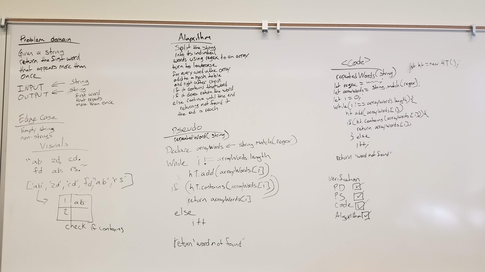

# Repeated word
Return the first word that repeats on a string.

## Challenge
* Write a function that accepts a lengthy string parameter.
* Without utilizing any of the built-in library methods available to your language, return the first word to occur more than once in that provided string.

## Approach & Efficiency
O(n) to add words
O(1) to check if the word has been repeated

## Solution


```Js
const _split = (string) =>{
  let regex = /\b(\w+)\b/g;
  return string.match(regex);
};

const repeatedWords = (string) => {
  let ht = new HT;
  let arrayWords = _split(string);
  for(let i = 0; i < arrayWords.length; i++){
    let value = arrayWords[i].toLowerCase();
    let key = value;
    if(ht.contains(value)){
      return value;
    }
    ht.add(key, value);
  }
  return 'No words found';
};
```