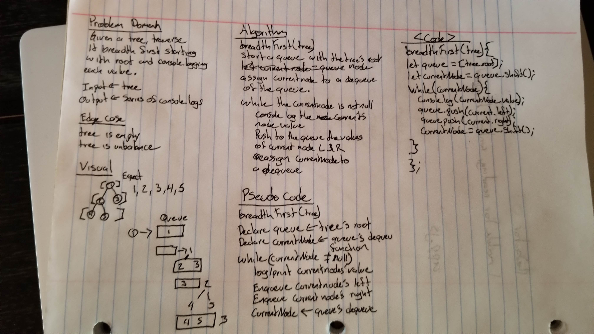

# BreadthFirst
Write a breadth first traversal method which takes a Binary Tree as its unique input. 

## Challenge
Without utilizing any of the built-in methods available to your language, traverse the input tree using a Breadth-first approach; print every visited node’s value.

### Input

### Output
```
2
7
5
2
6
9
5
11
4
```

## Approach & Efficiency
O(n). It will take as long as the tree is.

## Solution


## Code
```Javascript
  breadthFirst(tree) {
    if(tree.root === null) return 'This Tree is empty';
    let queue = [tree.root];
    let currentNode = queue.shift();

    while (currentNode) {
      console.log(currentNode.value);
      queue.push(currentNode.left);
      queue.push(currentNode.right);
      currentNode = queue.shift();
    }
  }
```