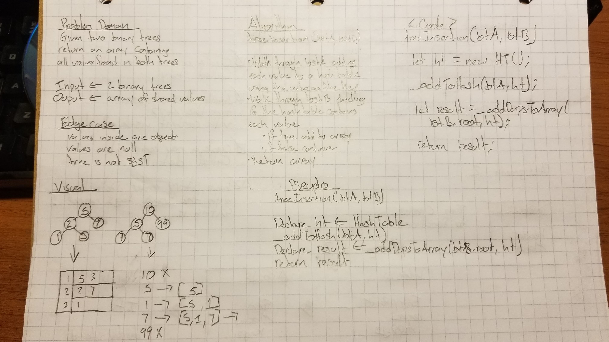

# Tree Insertion
Given two binary trees - return an array of all duplicate values between the trees

## Challenge
* Write a function called tree_intersection that takes two binary tree parameters.
* Without utilizing any of the built-in library methods available to your language, return a set of values found in both trees.

## Approach & Efficiency
* O(n) to add items to a hash table
* O(n) to check for suplication 

## Solution
```js
const treeInsertion = (btA, btB) => {
  let ht = new HT();

  if(btA.root === null || btB.root === null){
    throw new Error('No root value');
  }
  _addToHash(btA, ht);

  let result = _addDupsToArray(btB.root, ht);

  return result;

};

const _addToHash = (bt, ht) => {
  let arrayOfNumbers = bt.postOrder();
  arrayOfNumbers.forEach(element => {
    let key = element.toString();
    ht.add(key, element);
  });

  return arrayOfNumbers;
};

const _addDupsToArray = (root, ht) => {
  let result= [];
  let _walk = node => {
    if (node.left) _walk(node.left); // L
    if (node.right) _walk(node.right); // R
    let key = node.value.toString();
    if(ht.contains(key)){
      result.push(node.value);
    } // Ro

  };
  _walk(root);

  return result;
};

```


